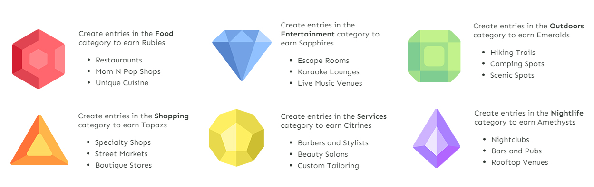
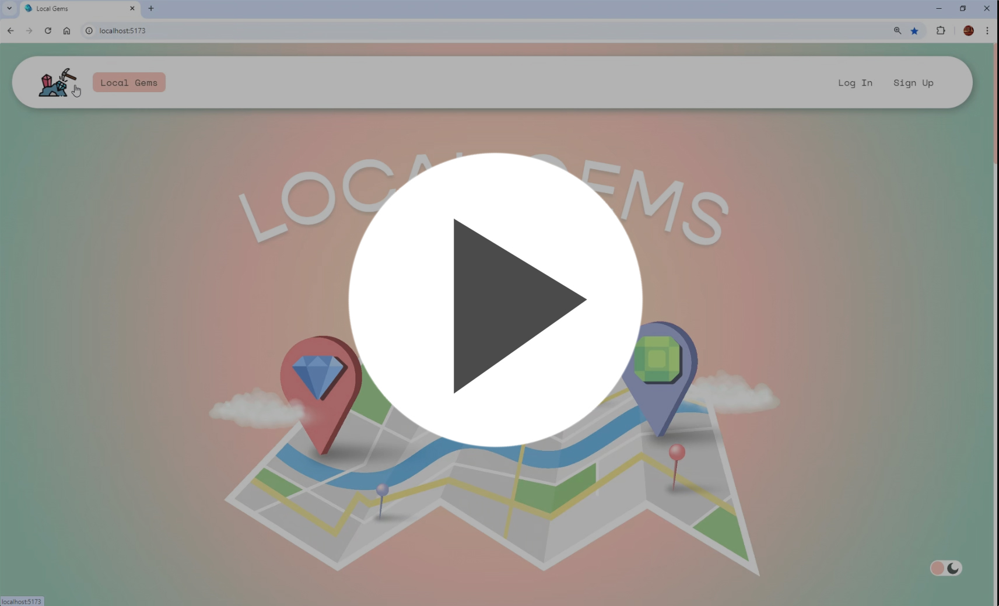
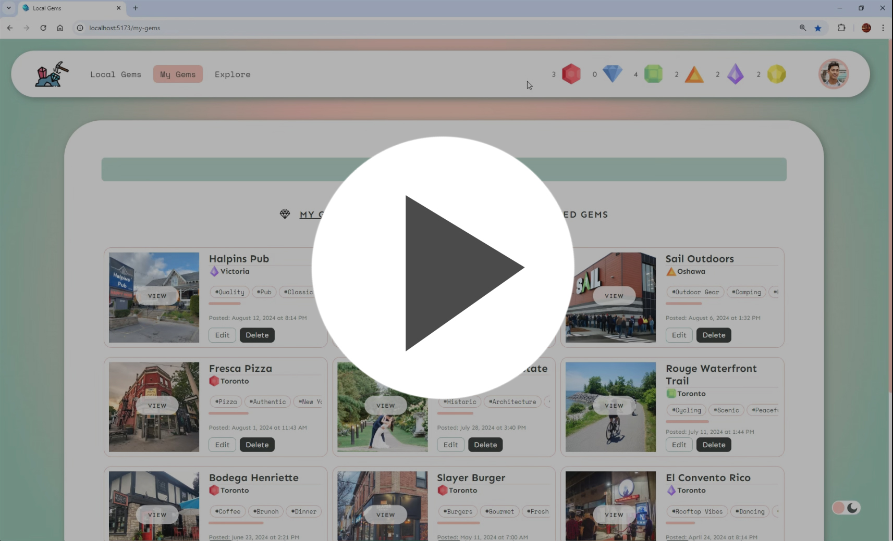
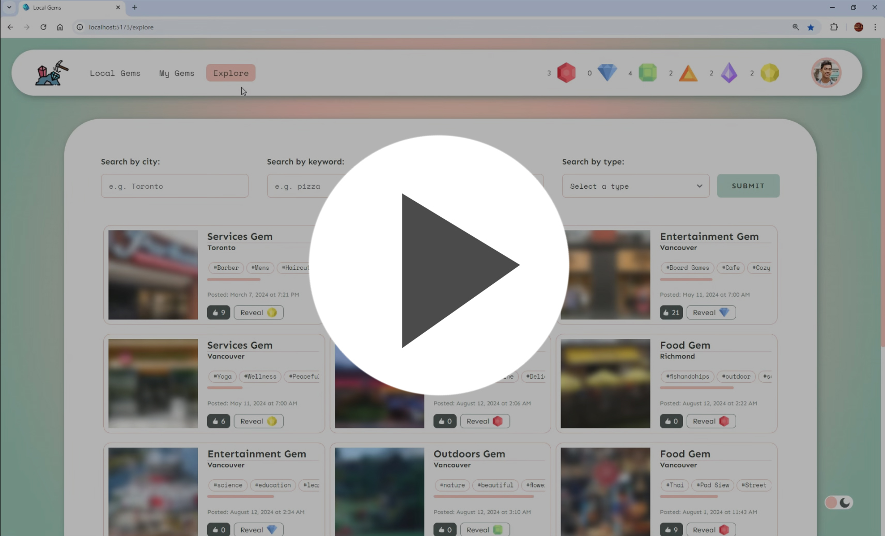
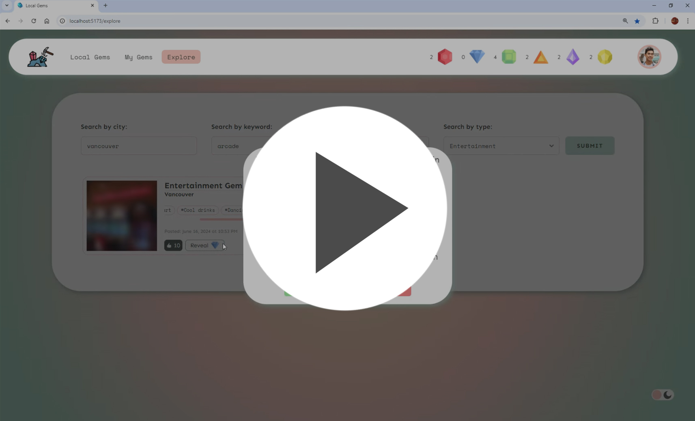
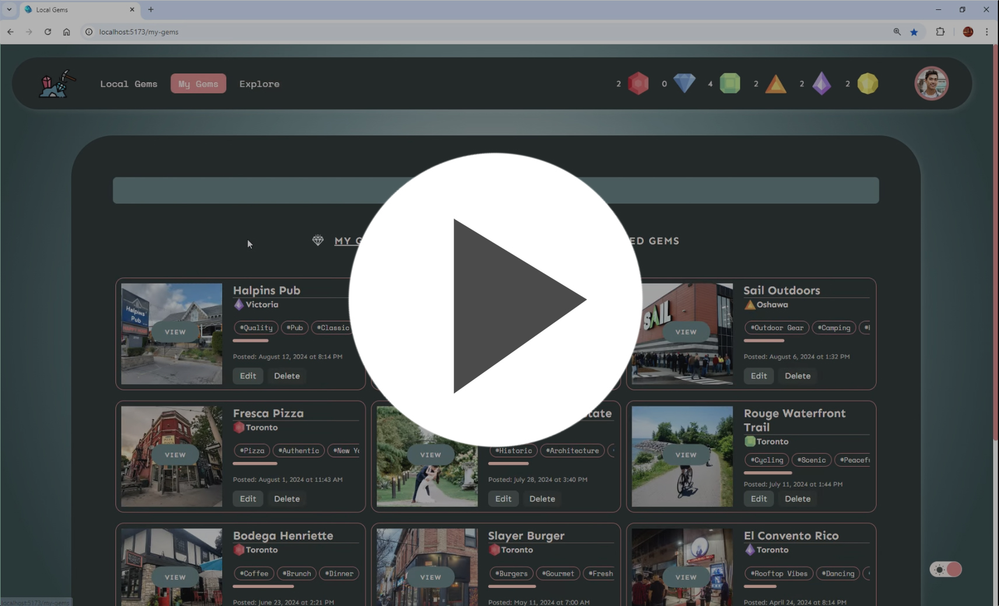

# Localgems 💎
LocalGems connects you with fellow explorers who share unique, off-the-beaten-path spots that only locals know about. 

Share a spot, discover a spot! Say goodbye to crowded tourist traps and hello to the best-kept secrets in town, from cozy cafes and artisanal shops to secluded spots out in nature. You can explore new cities like never before and contribute to a community of curious and adventurous explorers.


## Typical User Experience
Localgems has set of core features available to users:
- Account creation and login auth
- Creating new gems for others to discover your secret recommended spots
- A currency system featuring 6 different gemstones, each corresponding to a given location category
- Searching for hidden gems in your area and across different cities
- Unlocking hidden gems across the city with your saved up currency
- Viewing the Gem details, what people are saying about it, and viewing it with the Google Maps API
- Light/Dark mode toggle (defaults to the user system preference)

[]()

### Tech Stack
Localgems is built primarily on the MERN stack consisting of
- MongoDB
- Express
- React
- NodeJS

<br>
In addition to: 

- Babel
- Vite
- React Router
- SASS
- Google Maps API
- Tailwind
- Bcrypt
- CORS
- Dotenv
- Jsonwebtoken
- Dev dependencies
  - Nodemon
  - Morgan

## Setup

Install dependencies with `npm install` in each respective `/server` and `/client` directories.

### Backend Express server setup

Read `server/readme.md` and follow backend .env file setup details.<br>
Once your backend .env is setup, cd into the /server directory and run:  
```sh
npm run dev
```

### Frontend VITE React server setup

Read `client/readme.md` and follow frontend .env file setup details.<br>
Once your frontend .env is setup, open a second terminal and cd into the /client directory and run:
```sh
npm run dev
```

Once both client and servers are running without error, Go to http://localhost:5173/ in your browser to view the web client.

<br>

# Localgems In Action 

#### Landing page and Login
[](https://s1.webmshare.com/PJGJM.webm)

#### My Gems, Favourites and Unlocked Gems
[](https://s1.webmshare.com/5JvJb.webm)

#### Categories and Create Gem
[](https://s1.webmshare.com/LBXBo.webm)

#### Exploring Hidden Gems and Purchasing
[](https://s1.webmshare.com/rOvOJ.webm)

#### Unlocking hidden gems requires the corresponding gemstone
[](https://s1.webmshare.com/v0E0d.webm)

#### Darkmode and Logout
[](https://s1.webmshare.com/RLALq.webm)


# Contribution Credits
LocalGems was built in part by the skilled contributions of the following developers:
- Cynthia Lam - https://github.com/cynthia-lam
- Christopher Pytel - https://github.com/ChrisPytel
- Lubi Islam - https://github.com/lubi25
- Jeremiah Chua:  https://github.com/Ametrysinine


<!-- 

Links

https://webmshare.com/LBXBo
https://webmshare.com/RLALq
https://webmshare.com/rOvOJ
https://webmshare.com/PJGJM
https://webmshare.com/5JvJb
https://webmshare.com/v0E0d

 -->